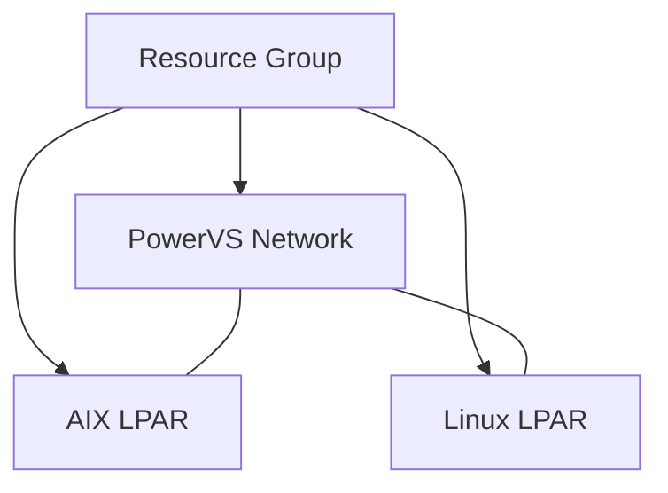

# powervs-terraform-bootstrap

Terraform configuration and module for bootstrapping an [IBM Power Virtual Server](https://www.ibm.com/products/power-virtual-server) lab with one AIX and one Linux LPAR. The configuration creates a resource group, network and two instances while tagging everything for easy clean up.



## Prerequisites
* IBM Cloud account with an existing PowerVS service instance
* IBM Cloud API key
* Terraform ≥ 1.6 and IBM Cloud provider ≥ 1.62.0
* SSH key uploaded to the PowerVS workspace
* Optional: Cloud Object Storage/S3 bucket for remote state

## Quickstart
```bash
git clone https://github.com/example/powervs-terraform-bootstrap
cd powervs-terraform-bootstrap
cp examples/simple/terraform.tfvars.example terraform.tfvars
terraform init
terraform apply
```

## Inputs
The root module expects the following variables. See `variables.tf` for full details.
* `ibmcloud_api_key`
* `region`
* `zone`
* `powervs_service_instance_id`
* `resource_group` (default: `powervs-lab`)
* `ssh_key_name`
* `aix_image_name` (default: `AIX 7.3 TLx`)
* `linux_image_name` (default: `RHEL 9 for Power`)
* `aix_profile` / `linux_profile` (default: `bx2-4x16`)
* `owner` (default: `unknown`)
* `environment` (default: `dev`)

## Outputs
After `terraform apply` the following outputs are printed:
* `aix_instance_id` – ID of the AIX LPAR
* `linux_instance_id` – ID of the Linux LPAR
* `network_id` – ID of the created network
* `aix_ip` – IP address of the AIX LPAR if available
* `linux_ip` – IP address of the Linux LPAR if available

## Remote State
The configuration uses local state by default. For team environments configure a remote backend such as IBM Cloud Object Storage:
```hcl
terraform {
  backend "s3" {
    endpoint   = "s3.direct.us-south.cloud-object-storage.appdomain.cloud"
    bucket     = "<your-bucket>"
    key        = "powervs-bootstrap/terraform.tfstate"
    access_key = var.cos_access_key
    secret_key = var.cos_secret_key
    skip_region_validation      = true
    skip_credentials_validation = true
  }
}
```

## Clean up
Destroy all resources when finished to avoid charges:
```bash
terraform destroy
```

## Cost
PowerVS instances are billed hourly. The default profiles keep resource usage small, but always destroy the environment when not in use.

## SSH Keys
`ssh_key_name` must reference an existing key in the PowerVS workspace. To upload a new key:
```bash
ibmcloud pi key-create --name my-key --public-key @~/.ssh/id_rsa.pub
```

## Examples
* `examples/simple` – minimal single-AIX and Linux lab
* `examples/ha-cluster` – placeholder for a future HA cluster

## Contributing
Contributions are welcome! Run `terraform fmt`, `terraform validate` and `tflint` before submitting pull requests.
